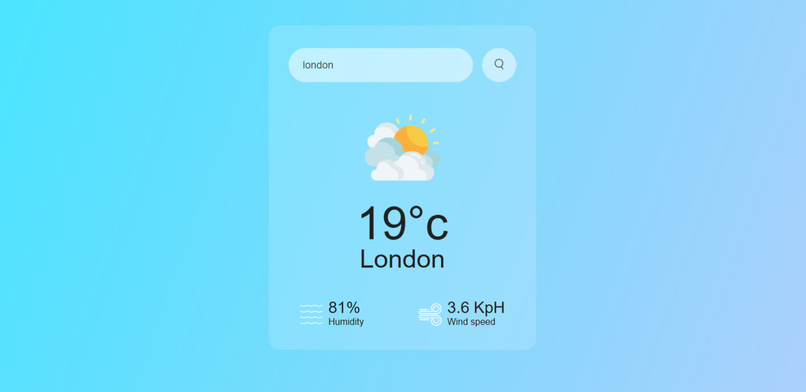

# Simple Weather

This is a simple weather application displaying real-time weather information based on user search input. It utilises HTML, CSS, and JavaScript to fetch data using the OpenWeatherMap API, summarising it into a clean, modern interface.



## Features

- Temperature
- Weather type
- Humidity
- Wind speed

## Tools and languages

- HTML, CSS, JavaScript
- [OpenWeather](https://openweathermap.org/) API

## Configuration

To use this application, you will need to obtain an API key from OpenWeatherMap.

- Go to [OpenWeather](https://openweathermap.org/)'s website and sign up for a free account
- After logging in, navigate to your profile and select the [API keys](https://home.openweathermap.org/api_keys) tab
- Generate a new API key and ensure it is active. Please note it may take some time for this to be fully activated for usage
- In the project files, open the script.js file in your favourite code editor
- Locate the following code at the top of the file and paste your key between the parentheses

```js
// Your key here
const apiKey = "";
// Your key here
```

## Usage

- By default, the interface displays a search bar
- Simply type in a location, and you're good to go


## Future updates

I hope you like my simple weather app. My goal for this one was a clean user interface that was not too complicated in terms of functionality. 

In the future I am considering interface updates, including adding a background that is responsive to weather conditions, but for now I am keeping it minimalist.